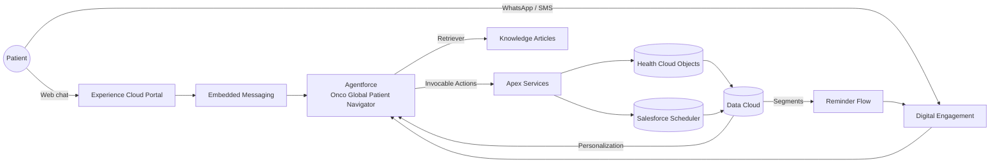

# Onco Global Patient Navigator

An Agentforce-powered "digital front door" for oncology patient scheduling, built on Salesforce Health Cloud. Patients can discover facilities and specialists, register, book / reschedule / cancel appointments, and receive reminders — via web chat, WhatsApp, or SMS — without ever handling a Salesforce record Id.

[](https://www.salesforce.com/products/health-cloud/overview/)
[]()
[]()

## What it does

- **Discovery** — patients ask "what oncology specialties do you offer in Mumbai?" and get a live answer from Health Cloud (`CareSpecialty`, `HealthcareFacility`, `HealthcareProvider`), never from cached memory or knowledge.
- **Self-service scheduling** — new-or-returning gate → registration (for first-time patients) → facility / specialty / provider discovery → `Get Available Appointment Slots` → `Book Appointment`, all conversationally.
- **Appointment management** — cancel or reschedule an existing booking by appointment number (`SA-0017`) plus email. Built-in 24-hour guardrail for late changes.
- **Transactional email + reminders** — welcome, booking confirmation, cancellation, reschedule notices; scheduled 24h and 4h reminders with idempotent per-appointment flags.
- **Knowledge fallback** — policy / procedure questions that are *not* about live data fall through to Lightning Knowledge (Einstein search).
- **Guest landing page** — Experience Cloud LWC (`healthPortalHome`) with a hero search, quick filters, and trust badges.

## Architecture



## Agentforce topic map

The planner bundle `Onco_Global_Patient_Navigator` routes every user turn to one of three topics. Topic-local actions keep permissions and scope clean; nothing lives at the planner level except the Knowledge fallback.

| Topic | Purpose | Actions |
|:--|:--|:--|
| **Onco Care Navigation** | Discovery + first-time booking | Find Cancer Care Facilities, Search Oncology Specialties, Find Oncology Providers, Get Available Appointment Slots, Register Patient, Book Appointment, List My Appointments |
| **Onco Appointment Manager** | Modify existing bookings | Manage Appointment (cancel / reschedule) |
| **General FAQ** | Policy & procedure questions | Answer Questions with Knowledge |

Specialty / department availability questions (including yes/no checks like *"do you have paediatric oncology?"*) are hard-gated to `Search Oncology Specialties` so the agent never answers from memory or stale Knowledge.

## Repository layout

```
force-app/main/default/
├── applications/                  # standard__HealthCloudConsole app
├── classes/                       # Apex services, Agentforce action facades, tests
├── genAiPlannerBundles/
│   └── Onco_Global_Patient_Navigator/   # topics, instructions, local actions
├── layouts/                       # page layouts for every scheduling object
├── lwc/
│   └── healthPortalHome/          # Experience Cloud guest landing page
├── objects/                       # Account, Contact, CareSpecialty, HealthcareFacility,
│                                  # HealthcareProvider, ServiceAppointment (+ reminder fields),
│                                  # ServiceTerritory, TimeSlot, Knowledge__kav, …
└── permissionsets/
    └── Onco_Global_Patient_Navigator842031091_Permissions.permissionset-meta.xml

docs/
├── implementation-plan/           # phase-by-phase build guide (01 → 11)
└── reference/
    └── agent-preview-test-prompts.md  # verified test-prompt bank + new-or-returning gate assertions

scripts/
├── apex/                          # anonymous Apex for seeding and patching
├── soql/                          # verification queries
└── shell/                         # deploy / retrieve helpers

manifest/
├── data-model.xml                 # data-model retrieve manifest
└── …

specs/                             # solution specs and design notes
```

### Key Apex components

| Class | Responsibility |
|:--|:--|
| `OncoDiscoveryFacilitiesAgent` / `OncoDiscoveryProvidersAgent` / `OncoDiscoverySpecialtiesAgent` | Agent-facing discovery actions; return patient-safe text + ids in `plannerReferenceText`. |
| `OncoSchedulingSlotsAgent` | Resolves candidate appointment times from `Salesforce Scheduler`. |
| `OncoSchedulingBook` / `OncoSchedulingCancel` / `OncoSchedulingReschedule` | Mutate `ServiceAppointment` records; fire transactional emails. |
| `OncoPatientRegister` | Idempotent Person Account registration (name + email + consent). |
| `OncoListAppointmentsAgent` | Lists a patient's past / upcoming visits by email only — never by Id. |
| `OncoAppointmentManager` | Self-service cancel / reschedule with 24h guardrail. |
| `OncoEmailService` | Welcome, booking, cancellation, and reschedule emails. |
| `OncoAppointmentReminderScheduler` | Schedulable Apex that sends 24h + 4h reminders once per appointment using `Reminder_24h_Sent__c` / `Reminder_4h_Sent__c` flags. |
| `OncoKnowledgeService` / `OncoKnowledgeSearchAgent` | Knowledge fallback for policy questions. |

## Getting started

### Prerequisites

- Salesforce **Health Cloud** org with Agentforce enabled
- **Salesforce CLI** (`sf`) v2.40+
- **Node.js** 20+ (for LWC Jest and Prettier)
- A Data Cloud / Agentforce admin license in the target org

### Clone & authorize an org

```bash
git clone https://github.com/Rdevang/Onco-Global-Health.git
cd Onco-Global-Health
npm install
sf org login web --alias onco-dev --set-default
```

### Deploy the project

```bash
# Deploy everything under force-app (preferred during dev)
sf project deploy start --source-dir force-app --target-org onco-dev

# Or deploy only the data-model slice
sf project deploy start --manifest manifest/data-model.xml --target-org onco-dev
```

Then seed sample data and publish knowledge articles:

```bash
sf apex run --file scripts/apex/seed_onco_data.apex --target-org onco-dev
sf apex run --file scripts/apex/seed_knowledge_articles_part1.apex --target-org onco-dev
sf apex run --file scripts/apex/seed_knowledge_articles_part2.apex --target-org onco-dev
sf apex run --file scripts/apex/publish_knowledge.apex --target-org onco-dev
sf apex run --file scripts/apex/seed_twenty_person_patients.apex --target-org onco-dev
```

Schedule the appointment reminder job (once per org):

```apex
System.schedule(
    'Onco Appointment Reminders - every 15 min',
    '0 0,15,30,45 * * * ?',
    new OncoAppointmentReminderScheduler()
);
```

## Testing

### Apex

```bash
sf apex run test --target-org onco-dev --code-coverage --result-format human --wait 10
```

Target coverage is **>= 85%** org-wide with 100% pass rate (phase-11 acceptance criteria).

### LWC Jest

```bash
npm run test:unit
```

### Linting / formatting

```bash
npm run lint
npm run prettier:verify
```

### Agent preview test prompts

A curated, verified test-prompt bank lives at [`docs/reference/agent-preview-test-prompts.md`](docs/reference/agent-preview-test-prompts.md) covering:

- discovery (specialties, facilities, providers)
- new-or-returning patient gate assertions
- booking / cancel / reschedule happy paths
- Salesforce Id leakage guardrails
- prompt-injection and medical-advice refusals
- end-to-end chaining regression guard

## Implementation plan

The project is organised into eleven phases. Each phase folder contains its own README with scope, deliverables, and acceptance criteria.

| # | Phase | Folder |
|:--|:--|:--|
| 01 | Org Prerequisites & Feature Enablement | [docs/implementation-plan/phase-01-prerequisites](docs/implementation-plan/phase-01-prerequisites/README.md) |
| 02 | Data Model & Sample Data | [docs/implementation-plan/phase-02-data-model](docs/implementation-plan/phase-02-data-model/README.md) |
| 03 | Lightning Knowledge Content | [docs/implementation-plan/phase-03-knowledge](docs/implementation-plan/phase-03-knowledge/README.md) |
| 04 | Apex Services & Invocable Actions | [docs/implementation-plan/phase-04-apex-services](docs/implementation-plan/phase-04-apex-services/README.md) |
| 05 | Agentforce Agent Configuration | [docs/implementation-plan/phase-05-agentforce](docs/implementation-plan/phase-05-agentforce/README.md) |
| 06 | Experience Cloud Patient Portal | [docs/implementation-plan/phase-06-experience-cloud](docs/implementation-plan/phase-06-experience-cloud/README.md) |
| 07 | Digital Engagement (WhatsApp + SMS) | [docs/implementation-plan/phase-07-digital-engagement](docs/implementation-plan/phase-07-digital-engagement/README.md) |
| 08 | Data Cloud Unification & Insights | [docs/implementation-plan/phase-08-data-cloud](docs/implementation-plan/phase-08-data-cloud/README.md) |
| 09 | Security, Sharing & Permission Sets | [docs/implementation-plan/phase-09-security](docs/implementation-plan/phase-09-security/README.md) |
| 10 | Demo Assets & Documentation | [docs/implementation-plan/phase-10-demo-and-docs](docs/implementation-plan/phase-10-demo-and-docs/README.md) |
| 11 | End-to-End Smoke Test | [docs/implementation-plan/phase-11-smoke-test](docs/implementation-plan/phase-11-smoke-test/README.md) |

When phase 11 passes on a freshly deployed org, the repo is ready to tag `v1.0-mvp` and hand off for pilot rollout.

## Conventions

- All metadata under `force-app/main/default/`.
- Anonymous Apex setup scripts under `scripts/apex/`; verification SOQL under `scripts/soql/`.
- Patient-facing identifiers are **appointment numbers** (e.g. `SA-0017`) and **email**; the agent never accepts or emits a Salesforce record Id.
- `patientLookupEmail` is a lookup key, not an outbound email — it's always a plain string.
- Apex classes that touch `CareSpecialty` or run on behalf of the agent user are declared `without sharing` to survive OWD restrictions; guest-accessible discovery queries are explicitly audited.

## Security & privacy notes

- No PHI in logs or in test artifacts under `docs/implementation-plan/phase-11-smoke-test/results/`.
- Trust Layer masking is expected to be active in production for name, phone, and email tokens passed to the LLM.
- The `Onco_Global_Patient_Navigator842031091_Permissions` permission set is the single source of truth for agent-user access; changes to scheduling / email / reminder classes must update it in the same commit.

## License

Internal / proprietary. Not for public redistribution.
